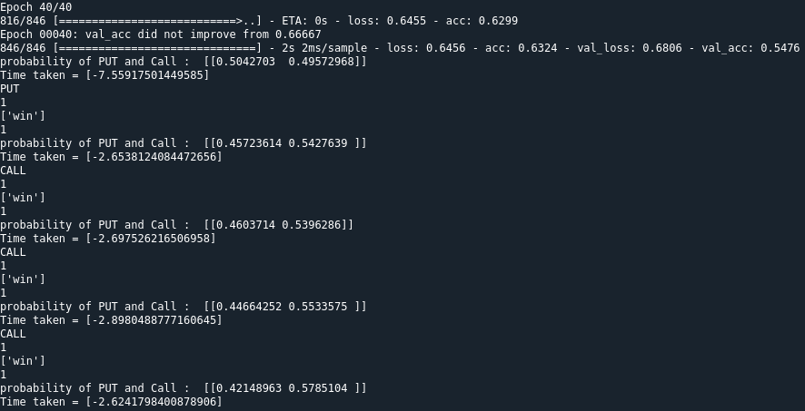

[](https://github.com/ItamarRocha) 
[](https://github.com/void-zero) 
[](https://github.com/jpvt) 
[](https://www.python.org/downloads/release/python-365/)

# binary-bot


Project of AI class at UFPB
This Project is under development. Any doubts or suggestion can be done in the Issues tab or by email.

## Contents
- [Motivation](#Motivation)
- [Setup](#Setup)
- [Data](#Data)
- [Getting_started](#Getting_started)

## Motivation

The purpose of this Artificial Intelligence project is to predict the result of the chosen binary option in the future

## Setup
- IQ OPTION API
Can be found in github at : https://github.com/Lu-Yi-Hsun/iqoptionapi (you must install it before running the code)
- tensorflow
```shell
$ pip install tensorflow
```
- Pandas
```shell
$ pip install pandas
```
- Numpy
```shell
$ pip install numpy
```

## Data

The data was gathered from the site IQ option API with the functions already mentioned in the code (iq.py).

## Getting_started

To use the code manteined in this repository, put your own username and password (in iq.py). Any alterations or improvements done in the code can be comunicated by email or in the issues tab.
After adding your personal information, just run the testing.py script and you are ready to go.


## License

[](http://badges.mit-license.org)

- **[MIT license](http://opensource.org/licenses/mit-license.php)**
